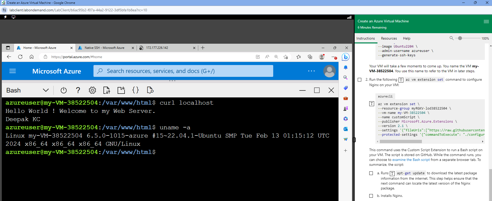

# Lab 2 - Create a Linux Virtual Machine & install Nginx

## Purpose / Learning Objective 

The objective of this task is to create an Azure virtual machine (VM) and install Nginx, a popular web server using the Azure CLI. You could use the Azure portal, the Azure CLI, Azure PowerShell, or an Azure Resource Manager (ARM) template. 

## Step-by-Step Guide
1. You will create the Linux Virtual Machine using the Azure CLI commands  and install Nginx . Launch the lab at this link and follow the guidelines: https://msle.learnondemand.net/Lab/54710?instructionSetLang=en&classId=584173

2. After creating the VM, come back to Moodle and use the following command to connect to your newly created VM. If you check the information, you get in cloud shell after creating VM, you will find the public IP there.
    - **ssh azureuser@publicIPAdressoftheVM**

3. At the time of creating the virtual machine, you have generated SSH key pairs, use it to connect to the VM and write the following commands to install Nginx web server: 
    1. To update: **sudo apt-get update**
    2. To install nginx: **sudo apt-get install -y nginx-core**
    3. Set your home Page: 
    - Get into the /var/www/html directory: cd /var/www/html
    - Create a simple html page (index.html) using nano text editor:  sudo nano index.html
    - The content of the index.html page is
   
      **Hello World ! Welcome to my Web Server.
      FirstName LastName**
      
4. Type the following commands and take the screenshot:
   
    1. **clear**
    2. **curl localhost**
    3. **uname -a**
  

**Assignment Return --> in "[Return-files](./Return-files/)" folder** 

After completing the above mentioned tasks, you will then upload the screenshot. Here is an example of the screenshot. 

Read More: 

[What is Azure CLI ?](https://learn.microsoft.com/en-us/cli/azure/what-is-azure-cli)
