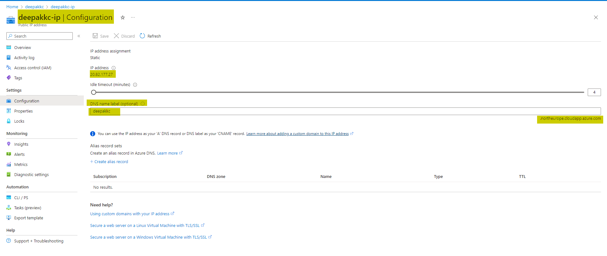
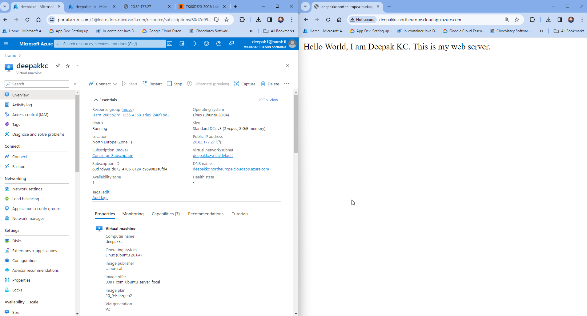

## Purpose / Learning Objective 

- This task aims to create an Azure virtual machine (VM), install Nginx, a popular web server and configure network access so that your web server is publicly available.
Note: You should use Microsoft Sandbox for this task. 

## Step-by-Step Guide
1. You will create a VM using the Azure Portal (https://learn.microsoft.com/en-us/training/modules/intro-to-azure-virtual-machines/3-create-a-vm) **(Note: From the link you should always activate the sandbox to be able to create Virtual Machines that is once you click Activate Sandbox, you can then login to the Azure Portal)**
2. Name the virtual machine as your firstnameLastnameWebserver. **Once you have created the virtual machine, continue the following tasks**: 
   1. Using your Visual Studio Code, you will make an SSH connection to the virtual machine
      - Note: You have downloaded ssh key at the time of creating the virtual machine in your download folder, move that private key to /username/.ssh/yourPK for example in my case:  C:\Users\deepak1\.ssh\deepakkc_key.pem
      - Then to login to the VM, use a terminal in VSC and type the following command (remember to replace your VM public IP address below)
        - **ssh -i "C:\Users\andy\.ssh\andy_key.pem" azureuser@vmIpaddress**
          
   2. Run the following commands to set up the Nginx server. 
     - **To update: sudo apt-get update**
     - **To install nginx: sudo apt-get install -y nginx**

   3. After installing the server, get to the folder /var/www/html in the virtual machine. 
     - Use the Nano text editor to create an HTML file as index.html. In the file type "Hello World, I am firstname_lastname. This is my web server."
  
3. Create the network security rule to allow inbound access on port 80 (HTTP)

4. Access your web server by typing the public IP address in the browser. You should see the page that you created earlier. 

5. Configure the DNS name for the virtual machine. It is possible to add a custom domain such as hamk. However, in this case, we are using Azure-provided DNS servers that are an "A record" that starts with the specified label and resolves to the public IP address of your virtual machine that will be registered. You will use your firstnamelastname as the DNS name label (do not use any spaces between your first and last name for example I would use deepakkc)

6. Type the **domain name** in the browser and you should see the page that you created earlier.

 **Assignment Return --> in "[Return-files](./Return-files/)" folder** 

After completing the tasks mentioned above, you will then upload the screenshot. Here is an example of the screenshot. 

Find the deadline for this task below.
Read More: 

https://learn.microsoft.com/en-us/training/modules/describe-azure-compute-networking-services/
