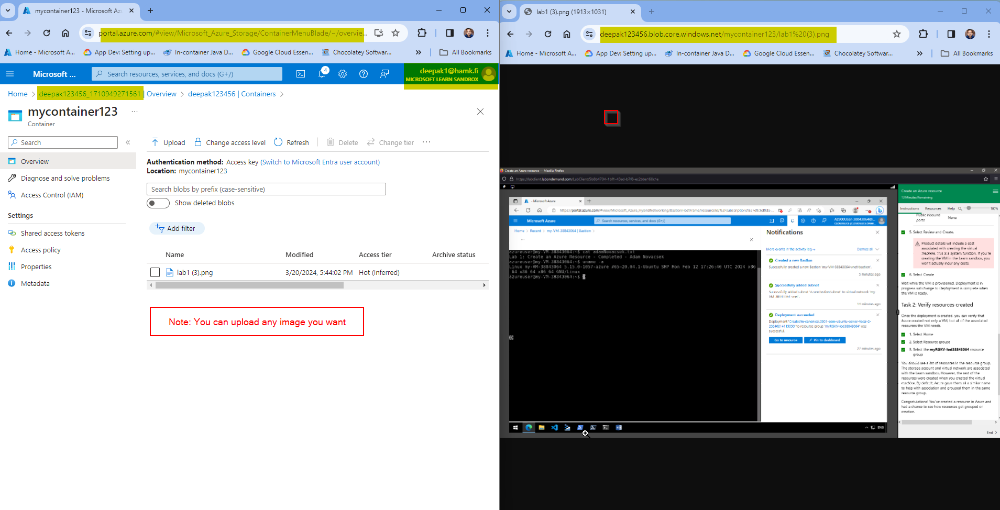

# Lab 4 - Create a storage bob

## Purpose / Learning Objective 

The objective of this task is to create a storage bob and change the access level of your bob.

**Note**: You will use Microsoft Sandbox for this task. 

**Please remember to activate your sandbox before using the sandbox subscription.**

https://learn.microsoft.com/en-us/training/modules/describe-azure-storage-services/5-exercise-create-storage-blob

## Step-by-Step Guide

1. Create a storage account as your firstnamelastname.
2. Create a blob container to store files. 
3. After creating the container, upload a file to the container. Change the access of the file so that it is publicly available.  

**Result return --> in "[Return-files](./Return-files/)" folder** 

After completing the above mentioned tasks, your result should be similar with below example:

Read More: 
https://learn.microsoft.com/en-us/training/modules/describe-azure-storage-services/

  
